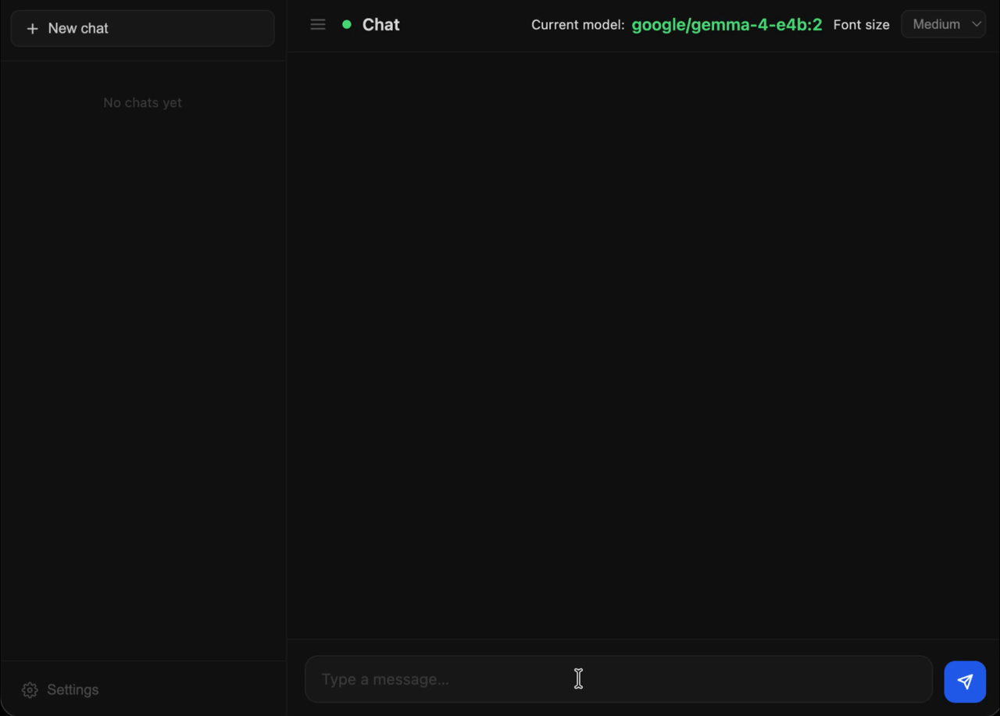

# 🤖 Chat AI Webapp


> A sleek, self-hosted web chat interface for local LLMs — built for [LM Studio](https://lmstudio.ai) and [Ollama](https://ollama.com), served by a lightweight Python proxy.


---



---

## ✨ Features

| Feature | Details |
|---|---|
| 🔌 **Multi-provider** | Connects to **LM Studio** or **Ollama** hosted on any machine on your network |
| 💬 **Persistent chat history** | Every conversation is saved as a human-readable `.md` file on the server |
| 📖 **GitHub-flavoured Markdown** | Assistant responses render full markdown with syntax-highlighted code blocks |
| ⚙️ **In-app settings** | Change the host URL, switch providers, select the active model, and set max output tokens — all without restarting |
| 🎨 **Adjustable font size** | Small → XL, remembered across sessions |
| ⚡ **Streaming responses** | Tokens stream in real time as the model generates them |
| 🔒 **No external dependencies** | The proxy server is pure Python stdlib — nothing to `pip install` |

---

## 🏗️ How It Works

```
Browser  ──►  Python proxy (port 3000)  ──►  LM Studio / Ollama (your network)
                     │
                  chats/*.md        ← persistent conversation history
                  settings.json     ← host URL, provider, model, token limit
```

The Python proxy solves browser CORS restrictions and keeps your LLM host details server-side. The frontend is a single `index.html` — no build step, no Node.js required.

---

## 🚀 Quick Start (without container)

**Requirements:** Python 3.6+ — no third-party packages needed.

```bash
# Clone or download the project, then:
python3 server.py
```

Open **http://localhost:3000** in your browser.

---

## 📦 Running with Podman

### 1 — Build the image

```bash
podman build -t chat-ai-webapp .
```

### 2 — Prepare persistent storage

```bash
mkdir -p chats
touch settings.json
```

### 3 — Run the container

```bash
podman run -d \
  --name chat-ai-webapp \
  -p 3000:3000 \
  -v ./chats:/app/chats:Z \
  -v ./settings.json:/app/settings.json:Z \
  chat-ai-webapp
```

> **`:Z`** sets the correct SELinux label on Fedora/RHEL hosts. Remove it if you are on a non-SELinux system.

Open **http://localhost:3000** in your browser.

### Useful container commands

```bash
# View logs
podman logs -f chat-ai-webapp

# Stop the container
podman stop chat-ai-webapp

# Start it again
podman start chat-ai-webapp

# Remove the container (your chats are safe in ./chats)
podman rm chat-ai-webapp

# Rebuild after code changes
podman build -t chat-ai-webapp . && podman restart chat-ai-webapp
```

---

## ⚙️ Configuration

Click the **⚙ Settings** button in the bottom-left of the sidebar to configure:

| Setting | Default | Description |
|---|---|---|
| **Provider** | LM Studio | Switch between LM Studio and Ollama |
| **Host URL** | `http://192.168.5.13:1234` | Address of your LLM server |
| **Active Model** | *(auto-detected)* | Choose from models available on the host |
| **Max Output Tokens** | `8192` | Maximum tokens the model can generate per response |

Settings are saved to `settings.json` and survive container restarts when the volume is mounted.

---

## 📁 Project Structure

```
chat-ai-webapp/
├── server.py        # Python proxy server + chat/settings API
├── index.html       # Full single-page frontend
├── Containerfile    # Podman/Docker build definition
├── settings.json    # Runtime settings (auto-created)
└── chats/           # One .md file per conversation (auto-created)
```

---

## 🔧 Requirements

- **LM Studio** (≥ 0.2) *or* **Ollama** (≥ 0.1.24) running somewhere on your network
- **Python 3.6+** for running directly, *or*
- **Podman** (any recent version) for the container
